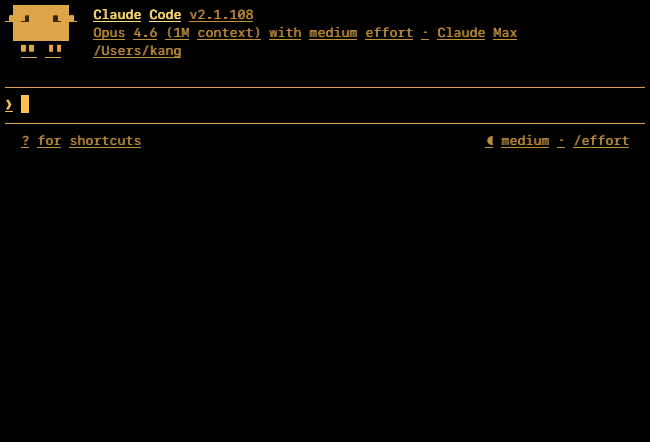
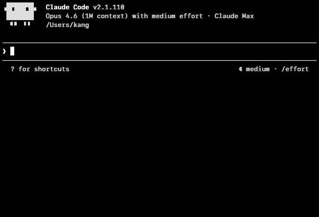
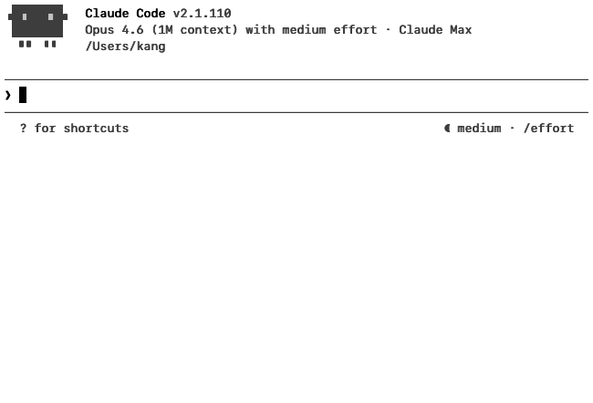
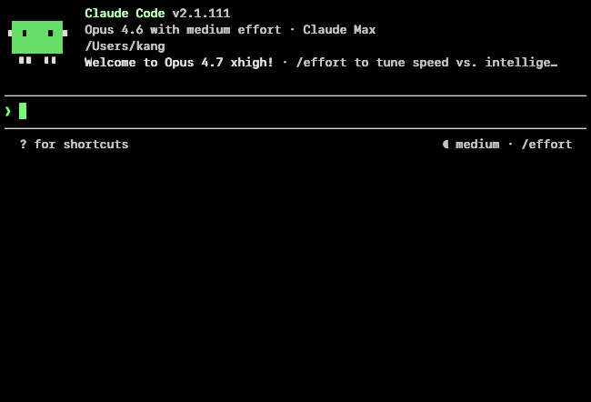
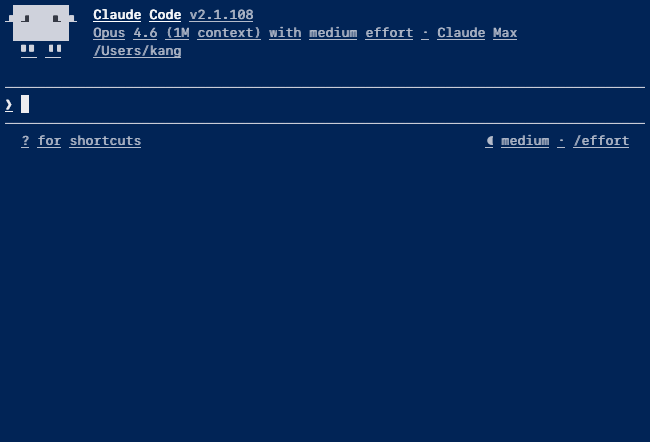

# vncvt

VNC terminal server with VT220 amber aesthetic. Serves an interactive bash session over the VNC (RFB) protocol, rendered with Skia + LCD-filtered AA on a configurable color palette. Works with any VNC client including macOS Screen Sharing.app.

## Theme showcase

Five built-in themes. Switch with `--theme NAME` on the CLI or press **F3** inside the VNC session to open SET-UP mode and cycle `Theme` live. Every theme ships an OKLCH-generated 16-color ANSI palette at uniform perceived lightness. All themes clear WCAG AAA on peak contrast; the secondary / hint-text modal pass WCAG AA at minimum.

| Theme | Preview | Colors | Modal† | Peak‡ |
|---|---|---|---|---|
| `amber` |  | warm amber on black | 9.91:1 | 12.73:1 |
| `dark` |  | white on black | 15.46:1 | 20.12:1 |
| `light` |  | black on white | 15.91:1 | 21.00:1 |
| `green` |  | phosphor green on black | 12.10:1 | 16.37:1 |
| `powershell` |  | off-white on navy `#012456` | 11.00:1 | 12.97:1 |

† **Modal** = WCAG ratio between the two most common colors in the actual rendered screenshot (i.e. bg vs the body text Claude Code paints).
‡ **Peak** = the theoretical max fg/bg contrast if every pixel were rendered at full palette extremes.

All screenshots captured at 80×24, SF Mono 13pt, `line-height 1.1`, `contrast high` (the default — thicker strokes compensate for anti-aliasing dimming on non-retina displays).

## Features

- Full RFB 3.8 protocol (works with any VNC client)
- Bash in a PTY with pyte VT100/VT102 terminal emulation
- Amber-tinted ANSI color palette (16 colors + 256-color support)
- 30fps incremental dirty-row updates
- Raw and zlib framebuffer encoding
- Keyboard input, special keys (arrows, F1-F12, Home/End, etc.)
- Ctrl+key combinations and paste support
- Configurable font, size, terminal dimensions

## Requirements

- Linux
- Python 3.11+
- [uv](https://docs.astral.sh/uv/)

## Quick start

```bash
# Install and run
uv run vncvt

# Connect with any VNC client to localhost:5900
```

## Options

```
--port PORT         VNC port (default: 5900)
--host HOST         Listen address (default: 127.0.0.1)
--cols COLS         Terminal columns (default: 80)
--rows ROWS         Terminal rows (default: 24)
--mode MODE         VT220 screen preset: 80x24 or 132x24
                    (mutually exclusive with --cols/--rows)
--font-size SIZE    Font size in points (default: 13). Glyphs are
                    rasterized via Skia with full TrueType hinting.
--font PATH         Path to a monospace TTF font (default: SF Mono
                    on macOS, DejaVu Sans Mono on Linux, Terminus
                    TTF as a vendored fallback)
--theme NAME        Color palette: light, dark, amber, green,
                    powershell (default: light)
--line-height MULT  Line height multiplier, 0.8–2.0 (default: 1.1)
--config PATH       Path to a TOML config file (default:
                    ~/.config/vncvt/config.toml)
--no-config         Skip loading the config file
--fps N             Framebuffer update rate cap, 1-120 (default: 30)
--shell SHELL       Shell to run (default: $SHELL)
--password PW       Enable VNC Authentication. Required for macOS
                    Screen Sharing.app.
--info              Print a JSON diagnostic (version, defaults, font
                    search path) and exit.
```

## VT220 SET-UP mode

Press **F3** from any connected client to toggle an in-terminal SET-UP
overlay modeled on the VT220's hardware configuration screen. Use the
overlay to change columns, rows, font size, and frame rate without
restarting the server.

| Key          | Action                                 |
|--------------|----------------------------------------|
| `F3`         | Toggle SET-UP mode (cancel if active)  |
| `Up` / `Down`| Navigate fields                        |
| `Return`     | Cycle the selected field's value       |
| `Left`       | Cycle backwards                        |
| `Escape`     | Apply changes and exit SET-UP          |

SET-UP mode lets you change Columns, Rows, Font size, FPS, **Theme**,
and **Line height** live and apply them with Escape. F3 no longer
reaches the shell while vncvt is running — it's always intercepted
by SET-UP mode.

## Config file

Persistent defaults live at `~/.config/vncvt/config.toml` (or
`$XDG_CONFIG_HOME/vncvt/config.toml`). Keys mirror the CLI flags
(kebab-case allowed):

```toml
theme = "light"
font-size = 13
line-height = 1.1
font = "/System/Library/Fonts/SFNSMono.ttf"
```

CLI flags override config values. Pass `--no-config` to skip the
file entirely.

## Examples

```bash
# Custom port and larger terminal
uv run vncvt --port 5901 --cols 120 --rows 40

# Use a custom font (e.g. DEC Terminal Modern)
uv run vncvt --font /path/to/DECTerminalModern.ttf

# Listen on all interfaces
uv run vncvt --host 0.0.0.0
```

## Testing

Run the loopback test (starts server, connects, types a command, saves screenshot):

```bash
uv run python -m vncvt --port 5996 &
uv run python test_loopback.py 5996 screenshot.png
kill %1
```

## Architecture

```
VNC Client <-> RFB Protocol (server.py) <-> Framebuffer (renderer.py)
                                                  |
                                            Pillow + amber colors
                                                  |
                                            pyte Screen buffer
                                                  |
                                            PTY (terminal.py)
                                                  |
                                              /bin/bash
```
