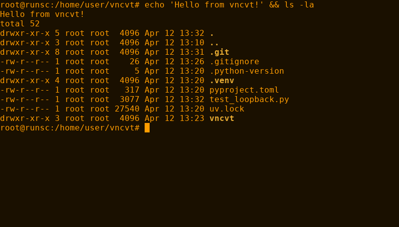

# vncvt

VNC terminal server with VT220 amber aesthetic. Serves an interactive bash session over the VNC (RFB) protocol, rendered with amber-tinted ANSI colors inspired by classic DEC VT220 phosphor displays.



## Features

- Full RFB 3.8 protocol (works with any VNC client)
- Bash in a PTY with pyte VT100/VT102 terminal emulation
- Amber-tinted ANSI color palette (16 colors + 256-color support)
- 30fps incremental dirty-row updates
- Raw and zlib framebuffer encoding
- Keyboard input, special keys (arrows, F1-F12, Home/End, etc.)
- Ctrl+key combinations and paste support
- Configurable font, size, terminal dimensions

## Requirements

- Linux
- Python 3.11+
- [uv](https://docs.astral.sh/uv/)

## Quick start

```bash
# Install and run
uv run vncvt

# Connect with any VNC client to localhost:5900
```

## Options

```
--port PORT         VNC port (default: 5900)
--host HOST         Listen address (default: 127.0.0.1)
--cols COLS         Terminal columns (default: 80)
--rows ROWS         Terminal rows (default: 24)
--mode MODE         VT220 screen preset: 80x24 or 132x24
                    (mutually exclusive with --cols/--rows)
--font-size SIZE    Font size in points (default: 11)
--font PATH         Path to a monospace TTF font
--fps N             Framebuffer update rate cap, 1-120 (default: 30)
--shell SHELL       Shell to run (default: $SHELL)
--password PW       Enable VNC Authentication. Required for macOS
                    Screen Sharing.app.
--info              Print a JSON diagnostic (version, defaults, font
                    search path) and exit.
```

## VT220 SET-UP mode

Press **F3** from any connected client to toggle an in-terminal SET-UP
overlay modeled on the VT220's hardware configuration screen. Use the
overlay to change columns, rows, font size, and frame rate without
restarting the server.

| Key          | Action                                 |
|--------------|----------------------------------------|
| `F3`         | Toggle SET-UP mode (cancel if active)  |
| `Up` / `Down`| Navigate fields                        |
| `Return`     | Cycle the selected field's value       |
| `Left`       | Cycle backwards                        |
| `Escape`     | Apply changes and exit SET-UP          |

Note: F3 no longer reaches the shell while vncvt is running — it's
always intercepted by SET-UP mode.

## Examples

```bash
# Custom port and larger terminal
uv run vncvt --port 5901 --cols 120 --rows 40

# Use a custom font (e.g. DEC Terminal Modern)
uv run vncvt --font /path/to/DECTerminalModern.ttf

# Listen on all interfaces
uv run vncvt --host 0.0.0.0
```

## Testing

Run the loopback test (starts server, connects, types a command, saves screenshot):

```bash
uv run python -m vncvt --port 5996 &
uv run python test_loopback.py 5996 screenshot.png
kill %1
```

## Architecture

```
VNC Client <-> RFB Protocol (server.py) <-> Framebuffer (renderer.py)
                                                  |
                                            Pillow + amber colors
                                                  |
                                            pyte Screen buffer
                                                  |
                                            PTY (terminal.py)
                                                  |
                                              /bin/bash
```
