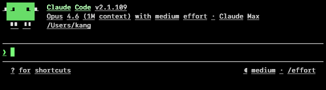
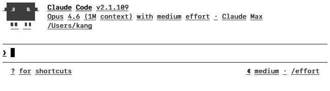
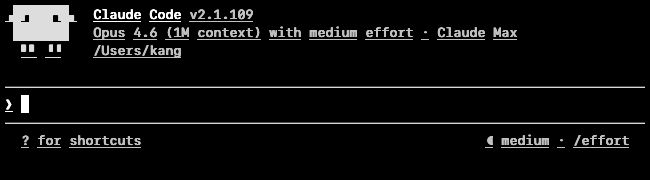
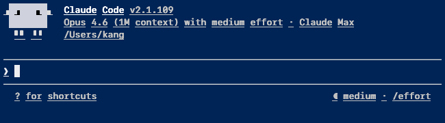

# Theme showcase

Five built-in themes, each with an OKLCH-generated 16-color ANSI palette at uniform perceived lightness. All clear WCAG AAA at peak contrast; body-text modal contrast clears AA on every theme.

All screenshots capture Claude Code's welcome panel at 80×24, SF Mono 13pt, `line-height 1.1`, `contrast max`, `color-mode phosphor` (the runtime defaults).

## `amber` — warm amber on black *(default)*


| Metric | Value |
|---|---|
| Background | `#000000` |
| Body text | `(255, 190, 80)` warm amber |
| Modal contrast | **9.91:1** |
| Peak contrast | 12.73:1 |
| Palette style | Hand-tuned `_AMBER_ANSI` — every ANSI slot is a variant of warm amber |

The primary aesthetic. Monotone by design: the OKLCH generator would pick canonical red/green/blue which defeats the "everything is amber phosphor" intent, so the palette is hand-tuned into a single-hue family.

## `green` — phosphor green on black



| Metric | Value |
|---|---|
| Background | `#000000` |
| Body text | `(120, 255, 120)` phosphor green |
| Modal contrast | **12.10:1** |
| Peak contrast | 16.37:1 |
| Palette style | Hand-tuned `_GREEN_ANSI` — every ANSI slot is a phosphor-green variant |

The "other" VT220-era aesthetic. Same single-hue design as amber. Classic IBM 3270 / DEC VT52 / Apple //e green-screen look.

## `light` — black on white



| Metric | Value |
|---|---|
| Background | `#ffffff` |
| Body text | `#000000` |
| Modal contrast | **15.91:1** |
| Peak contrast | 21.00:1 (WCAG maximum) |
| Palette style | OKLCH `base_l=0.40, bright_l=0.28, chroma=0.17` — dark colors on white |

Generated, not hand-tuned, but at low lightness (`base_l=0.40`) so dark-red / dark-blue / dark-green all perceptually collapse into "dark something" against the white bg. Looks near-monotone for the same reason amber and green do, despite having real chroma in every slot.

## `dark` — white on black



| Metric | Value |
|---|---|
| Background | `#000000` |
| Body text | `#ffffff` |
| Modal contrast | **15.46:1** |
| Peak contrast | 20.12:1 |
| Palette style | OKLCH `base_l=0.78, bright_l=0.92, chroma=0.17` — bright chromatic hues on black |

The "modern terminal" theme. Unlike amber/green/light, this one's generated at high lightness, so every ANSI slot pops as its own hue. More xterm than VT220.

## `powershell` — off-white on navy `#012456`



| Metric | Value |
|---|---|
| Background | `#012456` (Windows PowerShell classic navy) |
| Body text | `#EEEDF0` off-white |
| Modal contrast | **11.00:1** |
| Peak contrast | 12.97:1 |
| Palette style | OKLCH `base_l=0.78, bright_l=0.92, chroma=0.17` — same params as `dark`, different bg |

Shares the OKLCH parameters with `dark`, so the 16 ANSI hues are identical in RGB — only the bg color differs. On navy, Claude Code's ANSI 1 (red) borders read as a striking warm-red; on `dark` the same slot blends into the black bg.

## Palette taxonomy

Color is picked by two orthogonal knobs: **`--theme`** (aesthetic
family, bg/fg/hue) and **`--color-mode`** (fidelity tier, how ANSI
and truecolor inputs map onto that hue family). Each tier is anchored
to a specific PC display era:

| Tier | Anchor | What it renders |
|---|---|---|
| `phosphor` *(default)* | VT220 / MDA / Hercules (1981–83) | Single-hue, 16 intensity shades of the theme's primary hue. Every ANSI slot collapses into the theme's warm/green/navy/grey family — SGR index becomes a brightness cue, not a hue cue. |
| `16-color` | CGA / EGA (1981 / 1984) | 16 distinct hues (red, green, blue, yellow, magenta, cyan + brights), each rotated up to 30° toward the theme's primary hue. Still recognizably multi-hue, but with a family resemblance to the theme. |
| `256-color` | VGA Mode 13h (1987) | 256 slots: CGA 16 + xterm 6×6×6 cube (blended 40% toward the theme bg/fg midpoint for diminished chroma) + 24 greys along the theme's OKLab bg→fg axis. Hue intent survives; theme personality still comes through. |
| `true-color` | Win95 True Color / ISO 8613-6 (1995 / 2012+) | Raw passthrough. ANSI indices resolve via the standard xterm 256 table; 24-bit escapes render as raw RGB for bg (fg still lifted through the OKLab ramp for readability). The only tier where Claude Code's native palette renders faithfully. |

### Mode × theme matrix

Every (theme, mode) pair is a valid rendering — 5 themes × 4 tiers = 20 combinations. The default is `phosphor` on `amber`, a software approximation of a 1983 DEC VT220. Switch to `--color-mode true-color` to keep the theme's bg while letting Claude Code's native hues pass through.

See [`docs/design-color.md`](design-color.md) for the full tier
definitions, OKLCH rationale, and per-theme WCAG measurements.

Theme definitions live in [`vncvt/renderer.py` lines 25–140](../vncvt/renderer.py). The OKLCH generator is in [`vncvt/oklch.py`](../vncvt/oklch.py).

## Contrast measurement

- **Modal** = WCAG 2.1 ratio between the two most common colors in the rendered screenshot (usually bg vs body text — the dominant visual contrast the eye settles on).
- **Peak** = maximum fg/bg ratio the palette can produce — the best-case for any cell.

Both are measured on the actual rendered PNG, not computed from palette hex values, so they reflect the Skia AA + LCD filter + `contrast max` embolden exactly as the user sees them. The measurement script is [`scripts/measure_contrast.py`](../scripts/measure_contrast.py).

## Regenerating the screenshots

```bash
uv run python scripts/refresh_showcase.py
```

This spawns vncvt once per theme, drives Claude Code's welcome panel through a temporary profile, dumps the framebuffer via the scene-control socket, and saves both a full-height archival PNG (`claude-code-init-<theme>.png`) and a cropped version (`claude-code-<theme>.png`) used by this document.

Captures are timing-sensitive because Claude's welcome panel paints asynchronously — if a theme screenshot looks wrong, re-run just that theme:

```python
import asyncio
from scripts.refresh_showcase import capture_theme
asyncio.run(capture_theme('powershell'))
```
