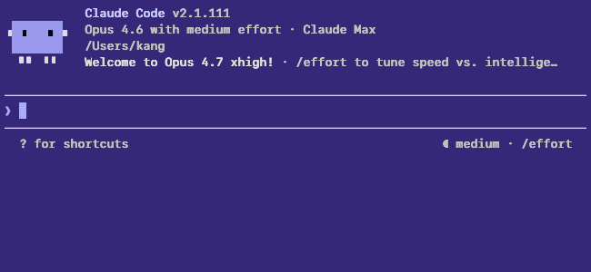
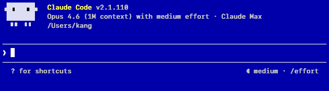
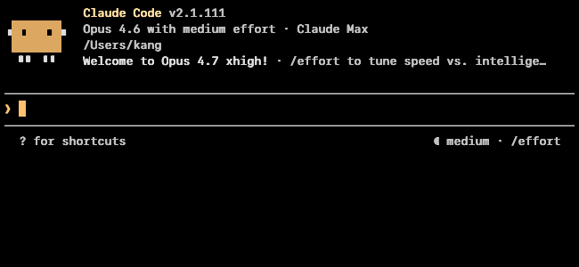

# Theme showcase

Seven built-in themes in two categories: **phosphor CRT types** (amber, green, dark, light) and **8-bit/PC color schemes** (c64, dos, atari). All clear WCAG AAA at peak contrast; body-text modal contrast clears AA on every theme.

All screenshots capture Claude Code's welcome panel at 80×24, SF Mono 13pt, `line-height 1.1`, `contrast max`, `color-mode phosphor` (the runtime defaults).

## `amber` — warm amber on black *(default)*


| Metric | Value |
|---|---|
| Background | `#000000` |
| Body text | `(255, 190, 80)` warm amber |
| Modal contrast | **9.91:1** |
| Peak contrast | 12.73:1 |
| Palette style | Hand-tuned `_AMBER_ANSI` — every ANSI slot is a variant of warm amber |

The primary aesthetic. Monotone by design: the OKLCH generator would pick canonical red/green/blue which defeats the "everything is amber phosphor" intent, so the palette is hand-tuned into a single-hue family.

## `green` — phosphor green on black


| Metric | Value |
|---|---|
| Background | `#000000` |
| Body text | `(120, 255, 120)` phosphor green |
| Modal contrast | **12.10:1** |
| Peak contrast | 16.37:1 |
| Palette style | Hand-tuned `_GREEN_ANSI` — every ANSI slot is a phosphor-green variant |

The "other" VT220-era aesthetic. Same single-hue design as amber. Classic IBM 3270 / DEC VT52 / Apple //e green-screen look.

## `light` — black on white


| Metric | Value |
|---|---|
| Background | `#ffffff` |
| Body text | `#000000` |
| Modal contrast | **15.91:1** |
| Peak contrast | 21.00:1 (WCAG maximum) |
| Palette style | OKLCH `base_l=0.40, bright_l=0.28, chroma=0.17` — dark colors on white |

Generated, not hand-tuned, but at low lightness (`base_l=0.40`) so dark-red / dark-blue / dark-green all perceptually collapse into "dark something" against the white bg. Looks near-monotone for the same reason amber and green do, despite having real chroma in every slot.

## `dark` — white on black


| Metric | Value |
|---|---|
| Background | `#000000` |
| Body text | `#ffffff` |
| Modal contrast | **15.46:1** |
| Peak contrast | 20.12:1 |
| Palette style | OKLCH `base_l=0.78, bright_l=0.92, chroma=0.17` — bright chromatic hues on black |

The "modern terminal" theme. Unlike amber/green/light, this one's generated at high lightness, so every ANSI slot pops as its own hue. More xterm than VT220.

## `c64` — Commodore 64 BASIC (Pepto NTSC)



| Metric | Value |
|---|---|
| Background | `#352879` (53, 40, 121) — Commodore dark purple |
| Body text | `#AAAAFF` (170, 170, 255) — boosted light blue |
| Bold | `#C8C8FF` (200, 200, 255) |
| Palette style | `_C64_PHOSPHOR` — blue-purple single-hue ramp, b≥r≥g invariant |

Based on the Pepto NTSC palette for the C64. The authentic screen fg `#706DEB` gives 3:1 against the Commodore bg — just below WCAG AA. The palette uses `#AAAAFF` (4.94:1) to clear AA while preserving the blue-on-blue character of the original.

## `dos` — CGA dark blue (WordPerfect / Norton Commander)



| Metric | Value |
|---|---|
| Background | `#0000AA` (0, 0, 170) — CGA color 1 dark blue |
| Body text | `#FFFFFF` (255, 255, 255) — white (16.9:1 AAA) |
| Bold | `#FFFF55` (255, 255, 85) — CGA bright yellow, DOS emphasis |
| Palette style | `_DOS_PHOSPHOR` — cool-white ramp from navy to white, b≥r=g invariant |

The classic DOS full-screen application bg: WordPerfect 5.1, Norton Commander, Turbo C, QBasic all used CGA color 1 (`#0000AA`) as their primary background.

## `atari` — Atari 8-bit GTIA register $2C



| Metric | Value |
|---|---|
| Background | `#000000` — black |
| Body text | `#FDC170` (253, 193, 112) — GTIA hue 2, luminance 6 (13.4:1 AAA) |
| Bold | `#FFDCA0` (255, 220, 160) |
| Palette style | `_ATARI_PHOSPHOR` — warm orange ramp, r≥g≥b invariant |

Colors sourced from the Lospec `atari-8-bit-family-gtia` palette. GTIA register $2C = hue 2 (orange-gold family), luminance 6 — the canonical "Atari warm orange" used on 800XL and 130XE systems.

## Palette taxonomy

Color is picked by two orthogonal knobs: **`--theme`** (aesthetic
family, bg/fg/hue) and **`--color-mode`** (how ANSI and truecolor
inputs map onto that hue family):

| Mode | Anchor | What it renders |
|---|---|---|
| `phosphor` *(default)* | VT220 / MDA / Hercules (1981–83) | Single-hue, 16 intensity shades of the theme's primary hue. Every ANSI slot collapses into the theme's warm/green/navy/grey/blue family — SGR index becomes a brightness cue, not a hue cue. |
| `true-color` | 24-bit color (1995+) | Raw passthrough. ANSI indices resolve via the standard xterm 256 table; 24-bit escapes render as raw RGB for bg (fg still lifted through the OKLab ramp for readability). The only mode where Claude Code's native palette renders faithfully. |

### Mode × theme matrix

Every (theme, mode) pair is a valid rendering — 7 themes × 2 modes = 14 combinations. The default is `phosphor` on `amber`, a software approximation of a 1983 DEC VT220. Switch to `--color-mode true-color` to keep the theme's bg while letting Claude Code's native hues pass through.

See [`docs/design-color.md`](design-color.md) for the full tier
definitions, OKLCH rationale, and per-theme WCAG measurements.

Theme definitions live in [`vncvt/renderer.py` lines 25–140](../vncvt/renderer.py). The OKLCH generator is in [`vncvt/oklch.py`](../vncvt/oklch.py).

## Contrast measurement

- **Modal** = WCAG 2.1 ratio between the two most common colors in the rendered screenshot (usually bg vs body text — the dominant visual contrast the eye settles on).
- **Peak** = maximum fg/bg ratio the palette can produce — the best-case for any cell.

Both are measured on the actual rendered PNG, not computed from palette hex values, so they reflect the Skia AA + LCD filter + `contrast max` embolden exactly as the user sees them. The measurement script is [`scripts/measure_contrast.py`](../scripts/measure_contrast.py).

## Regenerating the screenshots

```bash
uv run python scripts/refresh_showcase.py
```

This spawns vncvt once per theme, drives Claude Code's welcome panel through a temporary profile, dumps the framebuffer via the scene-control socket, and saves both a full-height archival PNG (`claude-code-init-<theme>.png`) and a cropped version (`claude-code-<theme>.png`) used by this document.

Captures are timing-sensitive because Claude's welcome panel paints asynchronously — if a theme screenshot looks wrong, re-run just that theme:

```python
import asyncio
from scripts.refresh_showcase import capture_theme
asyncio.run(capture_theme('atari'))
```
