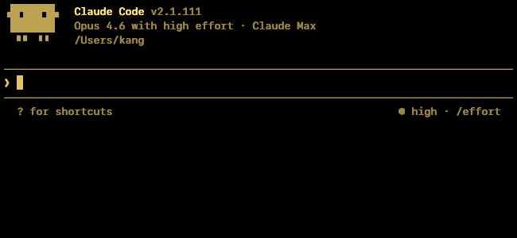
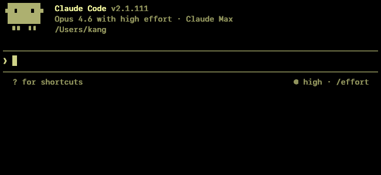
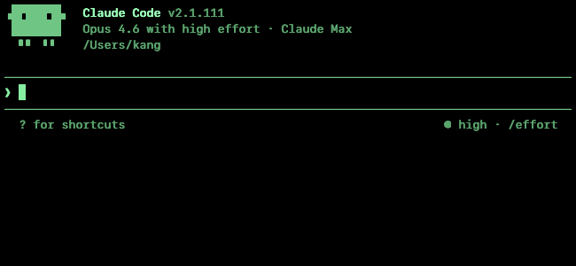
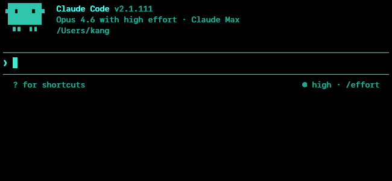
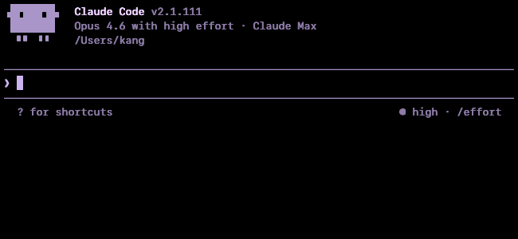
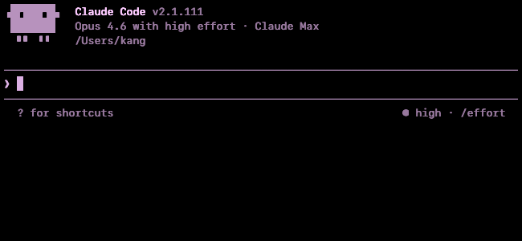
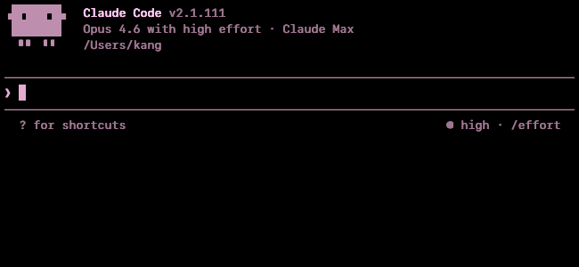
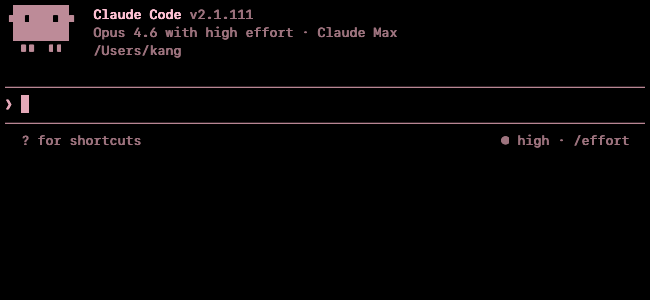

# Theme showcase

14 built-in themes. Screenshots capture Claude Code's welcome panel at 80×24, SF Mono 13pt, `line-height 1.1`, `contrast max`, `color-mode phosphor`.

## Phosphor CRT types

### `amber` — warm amber on black *(default)*


The primary aesthetic. Monotone by design: every ANSI slot is a variant of warm amber. A software approximation of a 1983 DEC VT220 amber phosphor CRT.

### `green` — phosphor green on black


Same single-hue design as amber. Classic IBM 3270 / DEC VT52 / Apple //e green-screen look.

### `dark` — white on black


White phosphor CRT (P4 coating). Neutral grey ramp — no hue tint.

### `light` — black on white


Paper-white display (original Macintosh 1984). Inverted polarity.

## 8-bit / PC color schemes

### `c64` — Commodore 64 BASIC (Pepto NTSC)


Blue-on-blue character of the original, with fg boosted to clear WCAG AA.

### `dos` — CGA dark blue (WordPerfect / Norton Commander)


The classic DOS full-screen application bg. WordPerfect 5.1, Norton Commander, Turbo C, QBasic all used CGA color 1 (#0000AA).

## Atari GTIA hues

### `yellow` — GTIA hue 4 — golden yellow



Atari GTIA $4C. Warm gold, distinct from amber.

### `olive` — GTIA hue 5 — yellow-green / olive



Atari GTIA $5C. Olive/lime tint.

### `mint` — GTIA hue 7 — blue-green / seafoam



Atari GTIA $7C. Cool mint, between green and cyan.

### `cyan` — GTIA hue 8 — teal



Atari GTIA $8C. Cool teal/cyan.

### `purple` — GTIA hue 11 — lavender



Atari GTIA $BC. Cool purple/lavender.

### `orchid` — GTIA hue 12 — orchid / pink-purple



Atari GTIA $CC. Warm orchid.

### `rose` — GTIA hue 13 — rose / magenta



Atari GTIA $DC. Warm rose pink.

### `salmon` — GTIA hue 14 — salmon pink



Atari GTIA $EC. Warm salmon, complementary to cyan.

## Color modes

| Mode | What it renders |
|---|---|
| `phosphor` *(default)* | Single-hue, 16 intensity shades. SGR index → brightness cue, not hue cue. |
| `true-color` | Raw passthrough. Standard xterm 256 palette + raw 24-bit RGB. The only mode showing native TUI colors. |

See [`docs/design-color.md`](design-color.md) for the full tier definitions and OKLCH rationale.

## Regenerating

```bash
uv run python scripts/refresh_showcase.py              # screenshots
uv run python scripts/refresh_showcase.py --generate-md  # this file
uv run python scripts/refresh_showcase.py amber mint    # just these
```

Configuration in [`docs/showcase.toml`](showcase.toml).
